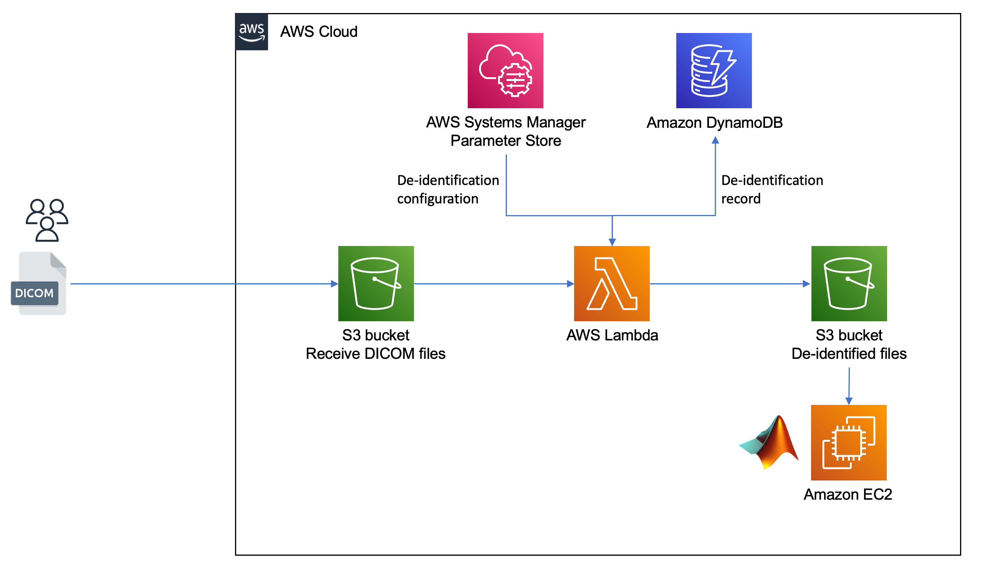

s3-dicom-processing
###################

Serverless processing of DICOM files received in S3

This solution provides a framework for per-file processing of DICOM images received in an S3 bucket.  Each file received in an S3 input path is processed by a Lambda function, stored in an output path, and a record made in a DynamoDB table. The DICOM processing is performed by the  `pydicom <https://pydicom.github.io/pydicom/stable/index.html>`_ library and is based upon a configuration JSON file stored in AWS Systems Manager Parameter Store. 

